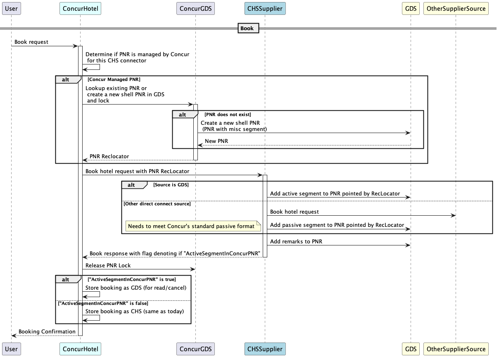

# Single PNR Solution For CHS



## Overview

This document describes the design of the Single PNR (passenger name record) Solution for Hotel's direct connect offering of the Custom Hotel Source (CHS) program.

For bookings made using CHS today, if passives are enabled, we have two PNRs associated with each hotel booking. The SAP Concur platform creates and manages a PNR in the appropriate GDS for the trip and adds a passive segment to that PNR with details of the hotel booking made by the CHS supplier. The CHS supplier also creates a PNR in the GDS with the active segment. Duplication of PNRs not only causes sync and operational issues but also adds cost for each booking. Hence, in cooperation with CHS suppliers, we have come up with a solution where there is only one PNR created for the CHS hotel booking. This solution will be applicable to both GDS and non-GDS content booked through the CHS supplier.

### Solution

At a high-level, the solution consists of:

- We pass an existing PNR locator or create a shell PNR (if hotel is first booking) to the Hotel Service v4 endpoint for hotel booking.
- TMC/Supplier confirms the hotel booking with their source (GDS or direct-connect) and works on the PNR (segment, remarks, etc.) and releases it back to us. If source is GDS, supplier will create an active segment. If source is direct-connect, supplier will create a passive segment.
- We take the PNR back and perform finishing.
- If GDS booking ("active" segment added by supplier) - all post-booking operations like `Retrieve` and `Cancel` will be managed as `GDS` booking within the SAP Concur platform. That is, Hotel Service v4 read and cancel endpoints will not be used and instead we will work directly with GDS to read/cancel booking.
- If the supplier supports `Modify` flow, we will use Hotel Service v4 endpoints to allow supplier to reshop and modify the booking.

## Requirements from TMC/Supplier for this Solution

- TMC/Supplier will use standard active and passive segment format as required by the SAP Concur platform.
- TMC/Supplier will have option to manage their own passive segment or use our managed solution for passives. If they choose to manage their own passives, they will need to:
  - Disable passive segment creation for CHS bookings to avoid duplicate passive creation for non-GDS hotels.
  - Create new passive segment in the SAP Concur platform created PNR along with booking with their direct connect source (as detailed in the design).
  - Cancel passive segment as part of their `cancel` flow along with canceling the booking with their direct connect source.

## Design

### Booking flow

The above sequence diagram shows the flow for booking a hotel using a CHS supplier that supports single PNR solution. Highlights of the flow are:

- A CHS supplier will never create a GDS PNR with this solution. During a booking request, we look up the existing PNR associated with the Trip and travel config used or create a new shell PNR and associate it with the trip.
- We obtain an internal lock on the PNR (for 60 secs) and send the hotel booking request to supplier with the PNR locator.
- If the supplier is booking with GDS, they will use this PNR locator to add the active segment to the PNR. If rate to book belongs to direct connect (e.g. Booking.com/Expedia), supplier will book with that direct connect and add a passive segment to PNR referenced by this record locator.
- Once booking is done, we will release the PNR lock making PNR available for further changes for example, adding Air/Car bookings, finishing, etc.
- If the supplier takes longer than 55 secs, booking transaction will time out.
- If the PNR lock times out, lock will be released automatically to allow further actions on this PNR. In order to prevent "Simultaneous access" errors for the user, it is necessary for supplier to honor this timeout and stop working on PNR after this. 
- Booking response from the supplier is expected to have `ActiveSegmentInConcurPNR` flag to indicate if the active segment was added to the SAP Concur platform PNR or not. This flag will be used to decide if we should treat this booking as GDS booking or direct-connect booking for post-booking functions.

### Cancel Flow

As mentioned earlier, if `ActiveSegmentInConcurPNR` is set to true, booking is treated as a GDS booking and we will manage cancel flow directly with GDS. Though, the CHS supplier will still be notified using the Hotel Service v4 [cancel endpoint](./v4.endpoints.html#cancel-). Note that invocation of `cancel endpoint` is only for notification to allow CHS supplier to perform any cancel related processing in their system and hotel booking with GDS should be already canceled at that time.

#### GDS Booking

- User initiates a cancel request and we cancel the active segment/trip in GDS and update storage with `Canceled` status with cancellation number.
- We send the `cancel` request to CHS supplier with cancel number. Note that this request is just acting as a notification to the CHS supplier as booking is already canceled in GDS.
- The `cancel` request can trigger any post-booking processing in CHS supplier system.

#### Direct Connect Booking

- User initiates a cancel request and we forward this cancel request to the CHS supplier.
- Supplier sends the cancel request to their direct connect source and also deletes any related passive segment if they created one for the booking. 
- Cancel response with cancellation number is returned to us which is then stored and displayed to user.

